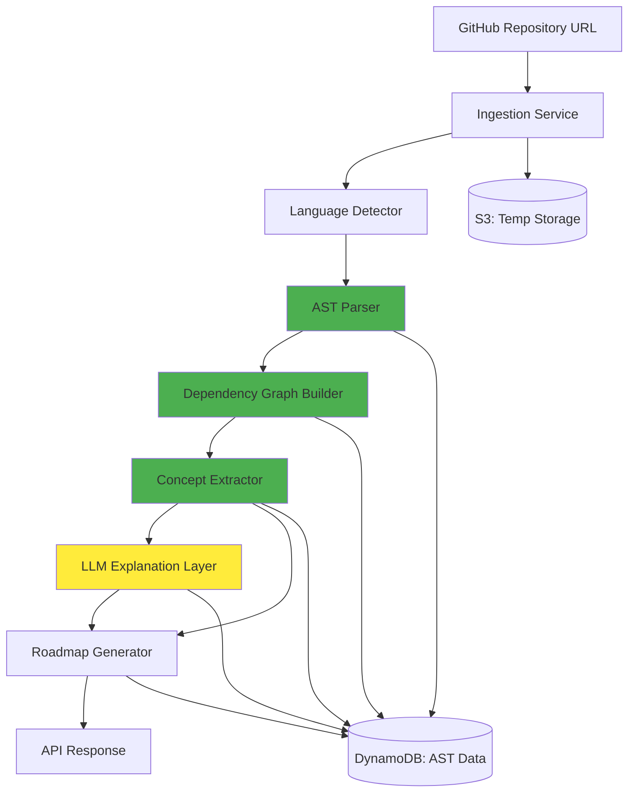

# Design Document: CODEXPATH AI

## Overview

CODEXPATH AI is an AI-powered code intelligence system that combines deterministic static analysis with LLM-based explanations to transform GitHub repositories into structured learning experiences. The system architecture strictly separates factual code analysis (deterministic, AST-based) from AI-generated interpretations (LLM-based explanations only).

The design follows a pipeline architecture:
1. Repository ingestion and validation
2. Language/framework detection
3. AST-based structural analysis (deterministic)
4. Dependency graph construction (deterministic)
5. Concept extraction (deterministic, pattern-based)
6. LLM explanation generation (inference layer only)
7. Learning roadmap generation (hybrid: structure is deterministic, recommendations are LLM-based)

Key principle: LLM is used ONLY for the explanation layer. All code analysis is deterministic and fact-based.

## High-Level Architecture



**Legend:**
- Green components: Deterministic, fact-based analysis
- Yellow components: LLM-based inference

## Component Breakdown

### 1. Ingestion Service
**Purpose:** Clone and validate GitHub repositories

**Responsibilities:**
- Accept GitHub repository URLs via API
- Validate repository accessibility
- Clone repository to S3 temporary storage
- Enforce size limits (100MB max)
- Validate presence of supported languages (JS/Python)
- Trigger language detection pipeline

**Technology:** AWS Lambda (Node.js or Python)

**Inputs:** Repository URL, optional authentication token
**Outputs:** Repository ID, storage location, validation status

**Error Handling:**
- Invalid URL → HTTP 400 with error details
- Repository too large → HTTP 413 with size information
- No supported files → HTTP 422 with detected file types
- Clone failure → HTTP 502 with descriptive error

### 2. Language Detector
**Purpose:** Identify programming languages and frameworks (deterministic)

**Responsibilities:**
- Scan repository for file extensions (.js, .jsx, .ts, .tsx, .py)
- Count files per language
- Calculate language percentages
- Parse package.json for JavaScript frameworks
- Parse requirements.txt and pyproject.toml for Python frameworks
- Extract framework versions when available

**Technology:** AWS Lambda (Python with file system scanning)

**Inputs:** Repository location in S3
**Outputs:** Language statistics, framework list with versions

**Detection Logic:**
```
For each file in repository:
  - Match extension against supported patterns
  - Increment language counter
  - Store file path for later processing

For each dependency file (package.json, requirements.txt, pyproject.toml):
  - Parse JSON/TOML structure
  - Extract dependency names and versions
  - Classify as framework or library based on known patterns
```

### 3. Static Analysis Engine (AST Parser)
**Purpose:** Parse source code into Abstract Syntax Trees (deterministic)

**Responsibilities:**
- Parse JavaScript/TypeScript files using Babel or TypeScript compiler
- Parse Python files using Python's ast module
- Extract function definitions (name, parameters, return types)
- Extract class definitions (name, methods, inheritance)
- Extract import/export statements
- Handle parsing errors gracefully (log and continue)
- Store AST data as structured JSON

**Technology:** AWS Lambda (separate functions for JS and Python)

**JavaScript Parsing:**
- Use @babel/parser for JavaScript/JSX
- Use TypeScript compiler API for TypeScript
- Extract: functions, classes, imports, exports, decorators

**Python Parsing:**
- Use Python's built-in ast module
- Extract: functions, classes, imports, decorators, type hints

**Data Structure:**
```json
{
  "file": "path/to/file.js",
  "language": "javascript",
  "functions": [
    {
      "name": "functionName",
      "parameters": ["param1", "param2"],
      "returnType": "string",
      "lineStart": 10,
      "lineEnd": 25,
      "isAsync": true,
      "isExported": true
    }
  ],
  "classes": [
    {
      "name": "ClassName",
      "extends": "BaseClass",
      "methods": [...],
      "lineStart": 30,
      "lineEnd": 100
    }
  ],
  "imports": [
    {
      "source": "./module",
      "imported": ["func1", "func2"],
      "isDefault": false
    }
  ]
}
```

**Error Handling:**
- Syntax errors → Log error, mark file as unparseable, continue
- Unsupported syntax → Extract what's possible, log warning
- File read errors → Log error, skip file

### 4. Dependency Graph System
**Purpose:** Build directed graph of module dependencies (deterministic)

**Responsibilities:**
- Construct graph from import statements
- Create nodes for each file with metadata (path, language, exports)
- Create directed edges for import relationships
- Detect circular dependencies using cycle detection algorithm
- Calculate dependency depth for each node
- Identify entry points (nodes with no incoming edges)
- Serialize graph to JSON

**Technology:** AWS Lambda (Python with networkx library)

**Graph Construction Algorithm:**
```
1. Create empty directed graph G
2. For each parsed file F:
   - Add node N with metadata: {path, language, exports}
3. For each import I in file F:
   - Resolve import path to target file T
   - Add edge (F, T) to graph G
4. Run cycle detection (DFS-based)
5. Calculate dependency depth (topological sort)
6. Identify entry points (nodes with in-degree = 0)
```

**Cycle Detection:**
- Use depth-first search with color marking (white/gray/black)
- Gray nodes indicate back edges (cycles)
- Store cycle information for reporting

**Data Structure:**
```json
{
  "nodes": [
    {
      "id": "src/index.js",
      "language": "javascript",
      "exports": ["main", "helper"],
      "dependencyDepth": 0,
      "isEntryPoint": true
    }
  ],
  "edges": [
    {
      "from": "src/index.js",
      "to": "src/utils.js",
      "importType": "named"
    }
  ],
  "cycles": [
    ["src/a.js", "src/b.js", "src/a.js"]
  ]
}
```

### 5. Concept Extraction Logic
**Purpose:** Identify programming patterns and architectural concepts (deterministic, pattern-based)

**Responsibilities:**
- Detect design patterns from structural signatures
- Identify architectural patterns from directory structure
- Extract API endpoints from framework-specific patterns
- Identify database models from ORM patterns
- Tag all extracted concepts as "FACT"
- Store concept metadata with source locations

**Technology:** AWS Lambda (Python with pattern matching rules)

**Pattern Detection Rules:**

**Design Patterns:**
- Singleton: Class with private constructor and static instance
- Factory: Function returning different class instances based on input
- Observer: Classes with subscribe/notify methods
- Decorator: Functions wrapping other functions with additional behavior

**Architectural Patterns:**
- MVC: Directories named models/, views/, controllers/
- Layered: Directories like api/, business/, data/
- Microservices: Multiple independent entry points

**Framework-Specific:**
- Express routes: app.get(), app.post() patterns
- React components: Classes extending React.Component or functional components
- Django models: Classes extending models.Model
- Flask routes: @app.route() decorators

**Extraction Algorithm:**
```
For each parsed file:
  For each pattern rule:
    If structural signature matches:
      Extract concept with metadata:
        - Pattern name
        - Confidence score (based on match completeness)
        - Source file and line numbers
        - Related code elements
        - Tag as "FACT"
```

**Data Structure:**
```json
{
  "concepts": [
    {
      "type": "design_pattern",
      "name": "Singleton",
      "confidence": 0.95,
      "sourceFile": "src/config.js",
      "lineStart": 10,
      "lineEnd": 30,
      "evidence": {
        "privateConstructor": true,
        "staticInstance": true,
        "getInstance": true
      },
      "tag": "FACT"
    }
  ]
}
```

### 6. LLM Explanation Layer
**Purpose:** Generate natural language explanations for extracted concepts (ONLY LLM-based component)

**Responsibilities:**
- Receive factual data from concept extractor
- Generate explanations for each concept
- Reference specific code locations in explanations
- Tag all output as "INFERENCE"
- Handle LLM service failures gracefully
- Preserve factual data if LLM fails

**Technology:** AWS Lambda with AWS Bedrock (Claude)

**Input Validation:**
- Accept ONLY data tagged as "FACT"
- Reject any data tagged as "INFERENCE"
- Validate presence of source locations

**Explanation Generation:**
```
For each concept:
  Prompt = f"""
  Explain the following code concept found in {concept.sourceFile}:
  
  Pattern: {concept.name}
  Type: {concept.type}
  Location: Lines {concept.lineStart}-{concept.lineEnd}
  Evidence: {concept.evidence}
  
  Provide:
  1. What this pattern does
  2. Why it might be used here
  3. How it relates to other code
  
  Reference specific line numbers.
  """
  
  explanation = call_bedrock(Prompt)
  tag_as_inference(explanation)
```

**Data Structure:**
```json
{
  "conceptId": "concept_123",
  "explanation": "The Singleton pattern in src/config.js (lines 10-30) ensures only one configuration instance exists...",
  "references": [
    {"file": "src/config.js", "line": 15},
    {"file": "src/config.js", "line": 22}
  ],
  "tag": "INFERENCE",
  "confidence": 0.85,
  "generatedAt": "2024-01-15T10:30:00Z"
}
```

**Error Handling:**
- LLM timeout → Return error, preserve facts
- LLM unavailable → Return error, preserve facts
- Invalid response → Log error, mark explanation as failed

### 7. Roadmap Engine
**Purpose:** Generate personalized learning paths (hybrid: structure is deterministic, recommendations are LLM-based)

**Responsibilities:**
- Accept user skill level (beginner/intermediate/advanced)
- Order concepts by dependency depth (deterministic)
- Group related concepts into modules (deterministic)
- Generate learning recommendations (LLM-based)
- Tag structure as "FACT", recommendations as "INFERENCE"
- Include file references for each step
- Output as structured JSON

**Technology:** AWS Lambda (Python for structure, Bedrock for recommendations)

**Roadmap Generation Algorithm:**
```
1. Load concepts and dependency graph (FACTS)
2. Topological sort concepts by dependency depth
3. Group concepts by:
   - Architectural layer
   - Related patterns
   - File proximity
4. For each group:
   - Create learning module (FACT)
   - Generate LLM recommendation (INFERENCE)
5. Order modules by complexity based on skill level
6. Add file references and estimated time
```

**Skill Level Adaptation:**
- Beginner: Start with entry points, focus on basic patterns
- Intermediate: Include architectural patterns, skip basics
- Advanced: Focus on complex patterns, optimization techniques

**Data Structure:**
```json
{
  "roadmap": {
    "skillLevel": "intermediate",
    "modules": [
      {
        "id": "module_1",
        "title": "Core Application Structure",
        "concepts": ["concept_1", "concept_2"],
        "order": 1,
        "estimatedTime": "30 minutes",
        "files": ["src/index.js", "src/app.js"],
        "tag": "FACT"
      }
    ],
    "recommendations": [
      {
        "moduleId": "module_1",
        "text": "Start by understanding the entry point in src/index.js...",
        "tag": "INFERENCE"
      }
    ]
  }
}
```

## AWS Infrastructure Mapping

### Compute Layer
- **Lambda Functions:**
  - `ingestion-service`: Clone and validate repositories
  - `language-detector`: Detect languages and frameworks
  - `js-ast-parser`: Parse JavaScript/TypeScript files
  - `py-ast-parser`: Parse Python files
  - `dependency-graph-builder`: Construct dependency graphs
  - `concept-extractor`: Extract patterns and concepts
  - `llm-explainer`: Generate explanations via Bedrock
  - `roadmap-generator`: Create learning roadmaps

### Storage Layer
- **S3 Buckets:**
  - `codexpath-repos-temp`: Temporary repository storage (1-hour TTL)
  - `codexpath-analysis-cache`: Cached analysis results (24-hour TTL)

- **DynamoDB Tables:**
  - `Repositories`: Repository metadata and status
    - Primary Key: `repositoryId`
    - Attributes: url, size, languages, status, createdAt
    - TTL: 30 days
  
  - `AnalysisResults`: Complete analysis data
    - Primary Key: `repositoryId`
    - Sort Key: `dataType` (ast|graph|concepts|explanations|roadmap)
    - Attributes: data (JSON), tag (FACT|INFERENCE), updatedAt
    - TTL: 30 days

### AI/ML Layer
- **AWS Bedrock:**
  - Model: Claude 3 Sonnet
  - Usage: Explanation generation only
  - Timeout: 30 seconds per request
  - Retry: 3 attempts with exponential backoff

### API Layer
- **API Gateway:**
  - REST API with API key authentication
  - Endpoints:
    - POST /analyze: Submit repository for analysis
    - GET /analysis/{repositoryId}: Retrieve analysis results
    - GET /roadmap/{repositoryId}: Retrieve learning roadmap
  - Rate limiting: 10 requests/minute per API key
  - CORS enabled for web clients

### Monitoring Layer
- **CloudWatch:**
  - Logs: All Lambda function logs
  - Metrics: Invocation count, duration, errors
  - Alarms: Error rate > 5%, duration > 180s

### Security Layer
- **IAM Roles:**
  - Lambda execution roles with least privilege
  - S3 access limited to specific buckets
  - DynamoDB access limited to specific tables
  - Bedrock access limited to explanation Lambda

- **Encryption:**
  - S3: Server-side encryption (SSE-S3)
  - DynamoDB: Encryption at rest enabled
  - API Gateway: HTTPS only

## Data Flow Diagram Explanation

### Analysis Pipeline Flow

```
1. User submits repository URL
   ↓
2. API Gateway validates API key
   ↓
3. Ingestion Service:
   - Validates URL
   - Clones to S3
   - Checks size (< 100MB)
   - Returns repositoryId
   ↓
4. Language Detector:
   - Scans files
   - Detects JS/Python
   - Extracts frameworks
   - Stores in DynamoDB (FACT)
   ↓
5. AST Parser (parallel for each file):
   - Parses to AST
   - Extracts functions/classes/imports
   - Stores in DynamoDB (FACT)
   ↓
6. Dependency Graph Builder:
   - Constructs graph from imports
   - Detects cycles
   - Calculates depths
   - Stores in DynamoDB (FACT)
   ↓
7. Concept Extractor:
   - Applies pattern rules
   - Identifies concepts
   - Stores in DynamoDB (FACT)
   ↓
8. LLM Explainer:
   - Loads concepts (FACT only)
   - Calls Bedrock for explanations
   - Tags output as INFERENCE
   - Stores in DynamoDB
   ↓
9. Roadmap Generator:
   - Loads concepts and graph
   - Orders by dependency depth (FACT)
   - Groups into modules (FACT)
   - Generates recommendations via LLM (INFERENCE)
   - Stores in DynamoDB
   ↓
10. API returns complete analysis
```

### Data Tagging Flow

```
Deterministic Components → Output tagged as "FACT"
  - Language Detector
  - AST Parser
  - Dependency Graph Builder
  - Concept Extractor
  - Roadmap structure

LLM Components → Output tagged as "INFERENCE"
  - LLM Explainer (all output)
  - Roadmap recommendations
```

### Caching Flow

```
1. Check DynamoDB for existing analysis
   ↓
2. If found and < 24 hours old:
   - Return cached results (< 2 seconds)
   ↓
3. If not found or expired:
   - Run full analysis pipeline
   - Cache results in DynamoDB
   - Return results
```

## Scalability Plan

### Horizontal Scaling
- **Lambda Concurrency:**
  - Reserved concurrency: 50 per function
  - Auto-scaling up to 1000 concurrent executions
  - Handles 100+ concurrent repository analyses

- **DynamoDB:**
  - On-demand capacity mode
  - Auto-scales read/write capacity
  - Supports 1000s of requests/second

### Performance Optimization
- **Parallel Processing:**
  - Parse files in parallel (fan-out pattern)
  - Use Step Functions for orchestration
  - Process up to 100 files simultaneously

- **Caching Strategy:**
  - Cache analysis results for 24 hours
  - Cache hit rate target: >70%
  - Reduces redundant processing

- **Data Compression:**
  - Compress JSON before storing in DynamoDB
  - Reduces storage costs by ~60%
  - Decompress on retrieval

### Load Management
- **API Rate Limiting:**
  - 10 requests/minute per API key
  - Prevents abuse and controls costs
  - Returns HTTP 429 when exceeded

- **Repository Size Limits:**
  - 100MB maximum
  - Prevents memory issues in Lambda
  - Rejects large repos early

### Cost Optimization
- **TTL Policies:**
  - S3 temp storage: 1 hour
  - Analysis cache: 24 hours
  - DynamoDB results: 30 days
  - Automatic cleanup reduces storage costs

- **Lambda Memory Tuning:**
  - AST parsers: 1024MB
  - Graph builder: 512MB
  - LLM explainer: 256MB
  - Right-sized for performance/cost balance

### Future Scaling Considerations
- **Multi-Region Deployment:**
  - Deploy to multiple AWS regions
  - Route based on user location
  - Improves latency globally

- **Language Support Expansion:**
  - Add new parser Lambdas for new languages
  - No changes to core architecture
  - Modular design supports easy extension

## Security Model

### Authentication & Authorization
- **API Key Management:**
  - API keys stored in DynamoDB with hashing
  - Validated on every request
  - Rate limits enforced per key
  - Keys can be revoked instantly

- **IAM Roles:**
  - Separate role for each Lambda function
  - Principle of least privilege
  - No cross-function access
  - Regular permission audits

### Data Security
- **Encryption:**
  - At rest: S3 (SSE-S3), DynamoDB (AWS managed keys)
  - In transit: HTTPS/TLS 1.2+ only
  - No plaintext sensitive data

- **Data Isolation:**
  - Each repository analysis isolated
  - No shared state between analyses
  - Temporary data deleted after processing

### Input Validation
- **Repository URLs:**
  - Validate GitHub URL format
  - Check for malicious patterns
  - Sanitize before cloning
  - Timeout on clone operations (30s)

- **File Processing:**
  - Validate file extensions
  - Limit file size (10MB per file)
  - Sandbox parsing operations
  - Handle malformed files gracefully

### Secrets Management
- **AWS Secrets Manager:**
  - Store GitHub tokens (if needed)
  - Rotate secrets automatically
  - Access via IAM roles only

### Audit & Monitoring
- **CloudWatch Logs:**
  - Log all API requests
  - Log all errors and exceptions
  - Retain logs for 30 days
  - Alert on suspicious patterns

- **CloudTrail:**
  - Track all AWS API calls
  - Monitor IAM changes
  - Detect unauthorized access attempts

### Compliance
- **Data Retention:**
  - Analysis results: 30 days max
  - Repository clones: 1 hour max
  - Logs: 30 days
  - No personal data stored

- **Privacy:**
  - No user tracking beyond API keys
  - No repository content stored long-term
  - Analysis results not shared between users

## Correctness Properties

*A property is a characteristic or behavior that should hold true across all valid executions of a system—essentially, a formal statement about what the system should do. Properties serve as the bridge between human-readable specifications and machine-verifiable correctness guarantees.*

### Property 1: Repository validation rejects oversized repositories
*For any* repository exceeding 100MB in size, the ingestion service should reject it and return an error message indicating the size limit was exceeded.
**Validates: Requirements 1.2**

### Property 2: Repository validation rejects unsupported languages
*For any* repository containing no JavaScript or Python files, the ingestion service should reject it and return an error message listing the detected file types.
**Validates: Requirements 1.3**

### Property 3: Clone failures return descriptive errors
*For any* repository that fails to clone, the system should return a structured error response containing an error code and descriptive message.
**Validates: Requirements 1.4**

### Property 4: Repository validation completes within time limit
*For any* repository submission, the validation process should complete within 30 seconds.
**Validates: Requirements 1.5**

### Property 5: File detection identifies all supported languages
*For any* repository, the language detector should correctly identify all files with extensions .js, .jsx, .ts, .tsx, .py and report accurate counts and percentages.
**Validates: Requirements 2.1, 2.2, 2.5**

### Property 6: Framework extraction from dependency files
*For any* repository containing package.json, requirements.txt, or pyproject.toml, the system should extract framework information from the dependencies section.
**Validates: Requirements 2.3, 2.4**

### Property 7: AST parsing produces valid structures
*For any* valid JavaScript or Python file, the AST parser should produce a valid AST structure that can be serialized to JSON.
**Validates: Requirements 3.1, 3.2**

### Property 8: Parsing errors don't halt processing
*For any* repository where some files fail to parse, the system should log the errors, continue processing remaining files, and return partial results.
**Validates: Requirements 3.3**

### Property 9: Function metadata extraction completeness
*For any* parsed file containing function definitions, the extracted metadata should include function name, parameters, and return type when available.
**Validates: Requirements 3.4**

### Property 10: Class metadata extraction completeness
*For any* parsed file containing class definitions, the extracted metadata should include class name, methods, and inheritance relationships.
**Validates: Requirements 3.5**

### Property 11: Import statement extraction
*For any* parsed file containing import statements, all import relationships should be extracted and stored with source and target information.
**Validates: Requirements 3.6**

### Property 12: AST data serialization round-trip
*For any* valid AST structure, serializing to JSON and deserializing should produce an equivalent structure.
**Validates: Requirements 3.7**

### Property 13: Dependency graph construction from imports
*For any* set of parsed files with import statements, the dependency graph should contain nodes for each file and directed edges for each import relationship.
**Validates: Requirements 4.1, 4.3**

### Property 14: Graph nodes contain required metadata
*For any* node in the dependency graph, it should contain metadata including file path and language.
**Validates: Requirements 4.2**

### Property 15: Circular dependency detection
*For any* set of files with circular import relationships, the system should detect and mark all cycles in the dependency graph.
**Validates: Requirements 4.4**

### Property 16: Dependency graph serialization round-trip
*For any* valid dependency graph, serializing to JSON and deserializing should produce an equivalent graph structure.
**Validates: Requirements 4.5**

### Property 17: Design pattern detection from structural signatures
*For any* code structure matching a known design pattern signature, the concept extractor should identify the pattern with appropriate confidence score.
**Validates: Requirements 5.1**

### Property 18: Architectural pattern detection from directory structure
*For any* repository with directory structure matching known architectural patterns, the system should identify the architectural pattern.
**Validates: Requirements 5.2**

### Property 19: Fact tagging for extracted concepts
*For any* concept extracted through deterministic analysis, it should be tagged with metadata field "type": "FACT".
**Validates: Requirements 5.3**

### Property 20: Concept metadata includes source location
*For any* extracted concept, the metadata should include the source file path and line numbers.
**Validates: Requirements 5.4**

### Property 21: Concept extraction output format
*For any* completed concept extraction, the output should be structured JSON containing all identified concepts with their metadata.
**Validates: Requirements 5.5**

### Property 22: LLM input validation accepts only facts
*For any* data passed to the LLM explanation layer, it should be validated to ensure it is tagged as "FACT" and not "INFERENCE".
**Validates: Requirements 6.1**

### Property 23: Explanation generation for all concepts
*For any* identified concept, the LLM explanation layer should generate a natural language explanation.
**Validates: Requirements 6.2**

### Property 24: Inference tagging for LLM output
*For any* content generated by the LLM explanation layer, it should be tagged with metadata field "type": "INFERENCE".
**Validates: Requirements 6.3**

### Property 25: Explanations reference code locations
*For any* generated explanation, it should contain references to specific code file paths and line numbers.
**Validates: Requirements 6.4**

### Property 26: LLM failure preserves factual data
*For any* LLM service failure, the system should return an error response while preserving all factual analysis data.
**Validates: Requirements 6.5**

### Property 27: Roadmap accepts all skill levels
*For any* skill level input (beginner, intermediate, advanced), the roadmap generator should accept it and generate an appropriate roadmap.
**Validates: Requirements 7.1**

### Property 28: Concept ordering by dependency depth
*For any* generated roadmap, concepts should be ordered by dependency depth with foundational concepts appearing before dependent concepts.
**Validates: Requirements 7.2**

### Property 29: Related concepts grouped into modules
*For any* generated roadmap, related concepts should be grouped together into learning modules based on architectural layer or pattern similarity.
**Validates: Requirements 7.3**

### Property 30: Learning steps include file references
*For any* learning step in a generated roadmap, it should include references to the relevant code files.
**Validates: Requirements 7.4**

### Property 31: Roadmap component tagging
*For any* generated roadmap, the structure should be tagged as "FACT" and learning recommendations should be tagged as "INFERENCE".
**Validates: Requirements 7.5**

### Property 32: Roadmap output format
*For any* completed roadmap generation, the output should be structured JSON with ordered learning steps and module groupings.
**Validates: Requirements 7.6**

## Error Handling

### Ingestion Errors
- Invalid URL format → HTTP 400 with validation details
- Repository not accessible → HTTP 404 with error message
- Repository too large → HTTP 413 with size information
- Clone timeout → HTTP 504 with timeout details
- Network errors → HTTP 502 with retry suggestion

### Parsing Errors
- Syntax errors in files → Log error, continue processing, mark file as failed
- Unsupported syntax → Extract partial data, log warning
- File read errors → Log error, skip file, continue
- Memory errors → Fail gracefully, return partial results

### LLM Errors
- Bedrock timeout → Return error, preserve facts, suggest retry
- Bedrock unavailable → Return error, preserve facts, degrade gracefully
- Invalid LLM response → Log error, mark explanation as failed
- Rate limit exceeded → Queue request, retry with backoff

### Storage Errors
- DynamoDB write failure → Retry 3 times with exponential backoff
- S3 upload failure → Retry 3 times, then fail request
- Data corruption → Validate checksums, reject corrupted data

### API Errors
- Invalid API key → HTTP 401 with authentication error
- Rate limit exceeded → HTTP 429 with retry-after header
- Malformed request → HTTP 400 with validation details
- Internal errors → HTTP 500 with error ID for tracking

## Testing Strategy

### Unit Testing
- Test each Lambda function independently
- Mock external dependencies (S3, DynamoDB, Bedrock)
- Test error handling paths
- Test edge cases (empty files, large files, malformed data)
- Target: >80% code coverage

### Property-Based Testing
- Use Hypothesis (Python) or fast-check (JavaScript)
- Minimum 100 iterations per property test
- Generate random repositories, files, and code structures
- Verify all 32 correctness properties
- Tag format: **Feature: codexpath-ai, Property {N}: {property text}**

**Example property tests:**
- Generate random file sets, verify language detection accuracy
- Generate random AST structures, verify serialization round-trip
- Generate random import graphs, verify cycle detection
- Generate random concepts, verify fact/inference tagging

### Integration Testing
- Test complete analysis pipeline end-to-end
- Use real GitHub repositories (small test repos)
- Verify data flow between components
- Test caching behavior
- Test concurrent analysis requests

### Performance Testing
- Measure analysis time for repositories of various sizes
- Verify 60-second target for 10MB repositories
- Test concurrent load (10+ simultaneous analyses)
- Measure cache hit rates
- Monitor Lambda cold start times

### Security Testing
- Test API key validation
- Test rate limiting enforcement
- Test input sanitization
- Verify encryption at rest and in transit
- Test IAM permission boundaries
